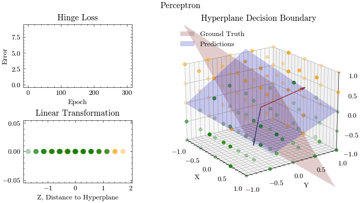

# Perceptron

Perceptron implementation

## Usage

### Running the program

```bash
jupyter notebook
```

### Running via Docker

Build the JupyterLab Docker image and start it

```bash
docker build -t perceptron .
docker run --rm -p 8888:8888 -v "$(pwd)":/home/jovyan/work perceptron
```

Open JupyterLab at the following URL: [http://127.0.0.1:8888/lab](http://127.0.0.1:8888/lab)

### Running via Docker Compose

Start the Docker image

```bash
docker compose up --build -d
```

Open JupyterLab at the following URL: [http://127.0.0.1:8888/lab](http://127.0.0.1:8888/lab)

Clean up the Docker container

```bash
docker compose down --volumes --rmi local
```

## Program Output


